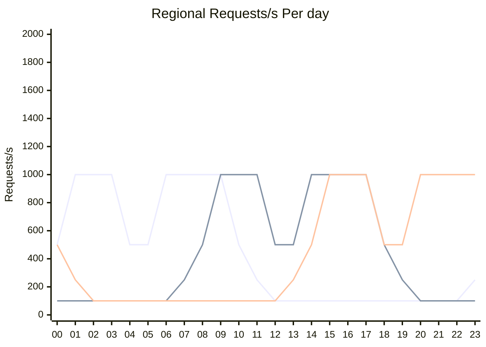
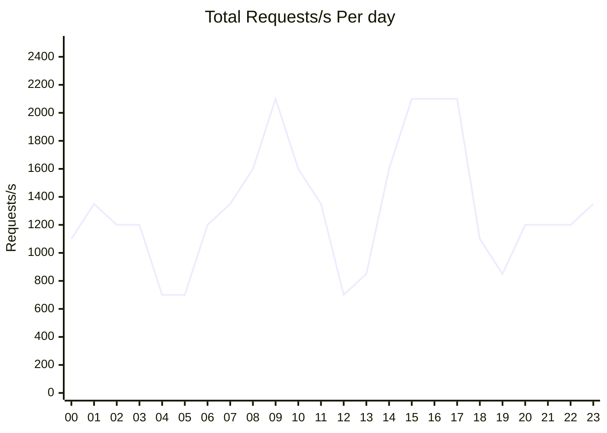

### Introduction

* If you're planning on self-hosting a multi-region CockroachDB cluster, you'll need to know how many nodes you'll need in each region.
* CockroachDB Cloud's Standard tier gives you a provisioned number of vCPUs to use across your cluster.
* So if one region is busier than the rest, it will receive more vCPU than the others.
* And as usage patterns across the regions change throughout the data, so too will the vCPUs.

### Cluster planning

Using arch.drawio, show how a cluster should be designed, based on the maximum estimated concurrent usage across all regions.

### Setup

Prerequisites

```sh
export COCKROACH_API_KEY="YOUR_API_KEY"
export GCP_PROJECT_NAME="YOUR GPC PROJECT"
```

Create Standard cluster

```sh
response=$(curl -s https://cockroachlabs.cloud/api/v1/clusters \
-H "Authorization: Bearer ${COCKROACH_API_KEY}" \
-H "Content-Type: application/json" \
-d '{
      "name": "crdb-asymmetric-workloads",
      "provider": "AWS",
      "plan": "standard",
      "spec": {
        "serverless": {
          "regions": [
            "us-east-1",
            "eu-central-1",
            "ap-southeast-1"
          ],
          "primary_region": "eu-central-1",
          "usage_limits": {
            "provisioned_virtual_cpus": 16
          }
        }
      }
    }')
```

Capture cluster config

```sh
export CLUSTER_ID=$(echo "$response" | jq -r .id)

export GLOBAL_HOST=$(echo "$response" | jq -r '.sql_dns')
export AP_HOST=$(echo "$response" | jq -r '.regions[0].sql_dns')
export EU_HOST=$(echo "$response" | jq -r '.regions[1].sql_dns')
export US_HOST=$(echo "$response" | jq -r '.regions[2].sql_dns')

pass=$(pa55 --out hex --len 18 --print)

export GLOBAL_URL="postgres://rob:${pass}@${GLOBAL_HOST}:26257/defaultdb?sslmode=verify-full"
export AP_URL="postgres://rob:${pass}@${AP_HOST}:26257/defaultdb?sslmode=verify-full"
export EU_URL="postgres://rob:${pass}@${EU_HOST}:26257/defaultdb?sslmode=verify-full"
export US_URL="postgres://rob:${pass}@${US_HOST}:26257/defaultdb?sslmode=verify-full"
```

Wait for cluster

```sh
curl -s https://cockroachlabs.cloud/api/v1/clusters/${CLUSTER_ID} \
-H "Authorization: Bearer ${COCKROACH_API_KEY}" | jq .state -r
```

Create user

```sh
curl -s https://cockroachlabs.cloud/api/v1/clusters/${CLUSTER_ID}/sql-users \
-H "Authorization: Bearer ${COCKROACH_API_KEY}" \
-H "Content-Type: application/json" \
-d "{ \"name\": \"rob\", \"password\": \"${pass}\" }"

```

Check connection strings

```sh
cockroach sql --url ${AP_URL} -e "SELECT gateway_region()"
cockroach sql --url ${EU_URL} -e "SELECT gateway_region()"
cockroach sql --url ${US_URL} -e "SELECT gateway_region()"
cockroach sql --url ${GLOBAL_URL} -e "SELECT gateway_region()"
```

Configure multi-region

```sh
cockroach sql --url ${EU_URL} -f cloud/standard/asymmetric-workloads/create.sql
```

# Demo starts here

### Demo

Deploy workload (fly.io)

```sh
fly app create crdb-asymmetric-workload --org crl-devrel

fly secrets set --app crdb-asymmetric-workload \
CONNECTION_STRING=${GLOBAL_URL} \
CONNECTION_STRING_US=${US_URL} \
CONNECTION_STRING_EU=${EU_URL} \
CONNECTION_STRING_AP=${AP_URL}

cp go.* cloud/standard/asymmetric-workloads/app
docker build --platform linux/amd64 -t registry.fly.io/crdb-asymmetric-workload:latest cloud/standard/asymmetric-workloads/app
rm cloud/standard/asymmetric-workloads/app/go.*

docker push registry.fly.io/crdb-asymmetric-workload:latest

(cd cloud/standard/asymmetric-workloads/app && fly deploy --ha=false -i registry.fly.io/crdb-asymmetric-workload:latest --remote-only)

(cd cloud/standard/asymmetric-workloads/app && fly scale count 3 --region iad,fra,sin --max-per-region 1 -y)
```





### Teardown

App (fly.io)

```sh
fly apps destroy crdb-asymmetric-workload -y
```

CockroachDB

```sh
curl -X DELETE -s https://cockroachlabs.cloud/api/v1/clusters/${CLUSTER_ID} \
-H "Authorization: Bearer ${COCKROACH_API_KEY}" \
-H "Content-Type: application/json" \
| jq .state -r
```

### Scratchpad

Connect

```sh
cockroach sql --url ${EU_URL}
```

```sql
SELECT DISTINCT
  split_part(unnest(replica_localities), ',', 1) AS replica_localities,
  replicas
FROM [SHOW RANGE FROM TABLE account FOR ROW (
  'aws-us-east-1',
  (SELECT id FROM account WHERE crdb_region = 'aws-us-east-1' LIMIT 1)
)]
UNION ALL
SELECT DISTINCT
  split_part(unnest(replica_localities), ',', 1) AS replica_localities,
  replicas
FROM [SHOW RANGE FROM TABLE account FOR ROW (
  'aws-eu-central-1',
  (SELECT id FROM account WHERE crdb_region = 'aws-eu-central-1' LIMIT 1)
)]
UNION ALL
SELECT DISTINCT
  split_part(unnest(replica_localities), ',', 1) AS replica_localities,
  replicas
FROM [SHOW RANGE FROM TABLE account FOR ROW (
  'aws-ap-southeast-1',
  (SELECT id FROM account WHERE crdb_region = 'aws-ap-southeast-1' LIMIT 1)
)];
```